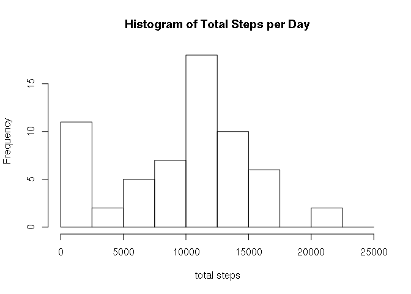
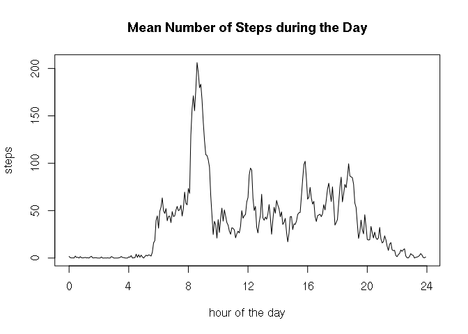
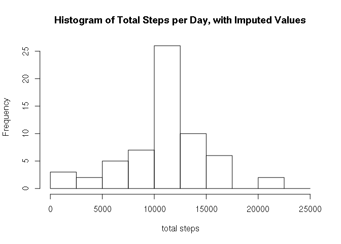
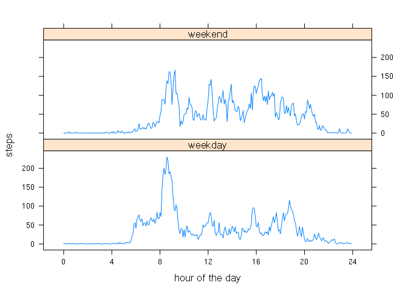

## Loading and preprocessing the data

Read data directly from the zip file.
Convert date string to proper `Date`.
From the 5-minutes interval, create a new column `hourInterval` with the interval as hour of the day, to make for nicer plots.


```r
activity <- read.csv(unz("activity.zip", "activity.csv"),
                       stringsAsFactors = FALSE)
activity$date <- as.Date(activity$date, "%Y-%m-%d")
activity$hourInterval <- activity$interval %/% 100 + (activity$interval %% 100) / 60
```


## What is mean total number of steps taken per day?


```r
totalSteps <- tapply(activity$steps, activity$date, sum, na.rm = TRUE)
meanSteps <- mean(totalSteps)
medianSteps <- median(totalSteps)

hist(totalSteps,
     main = "Histogram of Total Steps per Day",
     xlab = "total steps",
     breaks = seq(0, 25000, 2500))
```

<!-- -->

Mean number of steps per day: 9354.23  
Median number of steps per day: 10395


## What is the average daily activity pattern?


```r
intervalMeanSteps <- tapply(activity$steps, activity$hourInterval, mean, na.rm = TRUE)
maxInterval <- activity$interval[which.max(intervalMeanSteps)]

plot(intervalMeanSteps ~ names(intervalMeanSteps),
     type = "l",
     main = "Mean Number of Steps during the Day",
     xlab = "hour of the day",
     xaxp = c(0, 24, 6),
     ylab = "steps")
```

<!-- -->

The interval with (on average) maximum number of steps: 835.


## Imputing missing values

There are 2304 `NA` values for steps.
We use a simple strategy for imputing missing values: Take the mean number of steps in the corresponding interval (as computed above).


```r
imputed <- activity
naIndex <- which(is.na(imputed$steps))
for (i in naIndex) {
    intervalName <- as.character(imputed$hourInterval[i])
    imputed$steps[i] <- as.integer(intervalMeanSteps[intervalName])
}

impTotalSteps <- tapply(imputed$steps, imputed$date, sum, na.rm = FALSE)
impMeanSteps <- mean(impTotalSteps)
impMedianSteps <- median(impTotalSteps)

hist(impTotalSteps,
     main = "Histogram of Total Steps per Day, with Imputed Values",
     xlab = "total steps",
     breaks = seq(0, 25000, 2500))
```

<!-- -->

Mean number of steps per day with imputation: 10749.77, compared to 9354.23 without imputation.  
Median number of steps per day with imputation: 10641, compared to 10395 without imputation.

Imputing missing data leads to a strong reduction of days with very few steps (0-2500), and a strong increase of days with 10000-12500 steps. This is expected, as missing values enter the summation as 0, while an imputed value will always be greater than zero. Thus, without imputation, a day with completely missing values will enter the statistic as a day with zero steps. With imputed values, this same day will count with the average number of steps.


## Are there differences in activity patterns between weekdays and weekends?


```r
library(reshape2)
library(lattice)

imputed$weekday <- factor(weekdays(imputed$date, abbreviate = TRUE))
levels(imputed$weekday) <- list("weekday" = c("Mon", "Tue", "Wed", "Thu", "Fri"), "weekend" = c("Sat", "Sun"))

melted <- melt(imputed, id.vars = c("hourInterval", "weekday"), measure.vars = "steps")
totalSteps <- dcast(melted, hourInterval + weekday ~ variable, mean, na.rm = FALSE)

stepsPlot <- xyplot(steps ~ hourInterval | weekday, totalSteps,
                    type = "l",
                    layout = c(1, 2),
                    xlab = "hour of the day",
                    scales = list(
                        x = list(at = seq(0, 24, 4))
                    ))
print(stepsPlot)
```

<!-- -->

There is a clear difference in activity patterns, e.g., a reduced activity-peak in the morning on weekends and significantly more activity on weekends past 8pm.
This result also suggests that a more refined strategy, which takes into account the day of the week, should be used to impute missing values.

